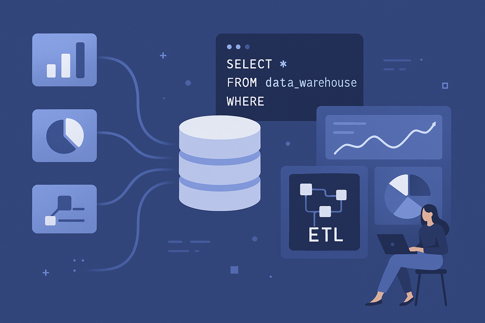
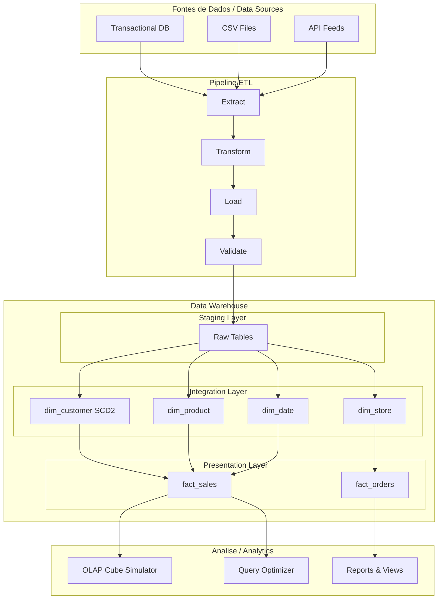
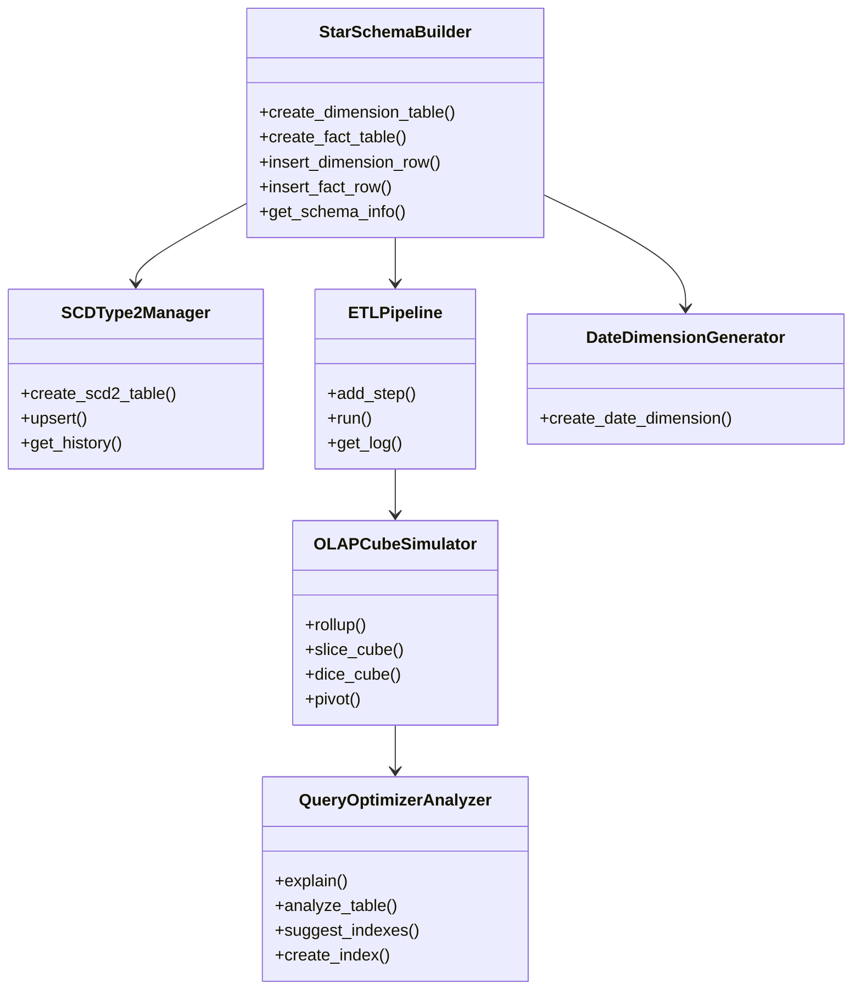

# SQL Data Warehouse Analysis

<p align="center">
  
</p>

[](https://www.python.org/)
[](https://sqlite.org/)
[](LICENSE)
[](Dockerfile)

Toolkit completo para construcao e analise de Data Warehouses utilizando SQL e Python com SQLite. Inclui construcao de star schema, gerenciamento de dimensoes SCD Type 2, pipelines ETL, simulacao de cubos OLAP e analise de otimizacao de queries.

Full toolkit for building and analyzing Data Warehouses using SQL and Python with SQLite. Includes star schema construction, SCD Type 2 dimension management, ETL pipelines, OLAP cube simulation, and query optimization analysis.

---

## Arquitetura / Architecture



## Componentes / Components



## Funcionalidades / Features

| Funcionalidade / Feature | Descricao / Description |
|---|---|
| Star Schema Builder | Criacao de tabelas dimensao e fato com chaves substitutas / Dimension and fact tables with surrogate keys |
| SCD Type 2 | Controle de historico de mudancas em dimensoes / Historical change tracking in dimensions |
| ETL Pipeline | Orquestracao de etapas extract-transform-load / ETL step orchestration with logging |
| OLAP Cube | Roll-up, slice, dice e pivot sobre dados do warehouse / OLAP operations over warehouse data |
| Query Optimizer | Analise de planos de execucao e sugestao de indices / Execution plan analysis and index suggestions |
| Date Dimension | Geracao automatica de calendario dimensional / Automatic calendar dimension generation |

## Estrutura / Project Structure

```
sql-data-warehouse-analysis/
├── src/
│   ├── ddl/                        # DDL scripts
│   │   ├── 01_create_schema.sql
│   │   ├── 02_create_staging_tables.sql
│   │   ├── 03_create_integration_tables.sql
│   │   └── 04_create_presentation_tables.sql
│   ├── etl/
│   │   └── etl_master.sql
│   ├── procedures/
│   │   ├── sp_generate_date_dimension.sql
│   │   ├── sp_load_dimension_scd2.sql
│   │   ├── sp_load_fact_sales_order.sql
│   │   └── sp_load_fact_sales_order_line.sql
│   ├── views/
│   │   ├── vw_campaign_performance.sql
│   │   ├── vw_inventory_analysis.sql
│   │   └── vw_sales_performance.sql
│   └── warehouse_toolkit.py
├── tests/
│   └── test_warehouse_toolkit.py
└── README.md
```

## Inicio Rapido / Quick Start

```python
from src.warehouse_toolkit import StarSchemaBuilder, SCDType2Manager, OLAPCubeSimulator

# Construir star schema
builder = StarSchemaBuilder(":memory:")
builder.create_dimension_table("dim_product", {"name": "TEXT", "category": "TEXT"})
builder.create_fact_table("fact_sales", {"amount": "REAL"}, {"product_sk": "dim_product"})

pk = builder.insert_dimension_row("dim_product", {"name": "Widget", "category": "Tools"})
builder.insert_fact_row("fact_sales", {"product_sk": pk, "amount": 150.0})

# SCD Type 2
scd = SCDType2Manager(builder.conn, "dim_customer")
scd.create_scd2_table({"customer_id": "TEXT", "name": "TEXT", "city": "TEXT"})
scd.upsert("customer_id", {"customer_id": "C001", "name": "Alice", "city": "SP"}, "2024-01-01")
scd.upsert("customer_id", {"customer_id": "C001", "name": "Alice", "city": "RJ"}, "2024-06-01")
history = scd.get_history("customer_id", "C001")  # 2 versions

# OLAP
cube = OLAPCubeSimulator(builder.conn, "fact_sales")
results = cube.rollup(["product_sk"], "amount")
```

## Testes / Tests

```bash
pytest tests/ -v
```

## Tecnologias / Technologies

- Python 3.9+
- SQLite3
- pytest

## Licenca / License

MIT License - veja [LICENSE](LICENSE) para detalhes / see [LICENSE](LICENSE) for details.
